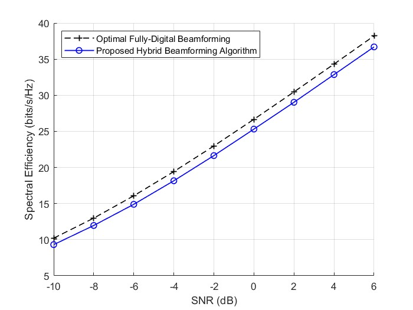

# SimLit-2016-JSTSP-Sohrabi

Reproduce the following paper in Matlab:

- Sohrabi, F. & Yu, W. (2016). Hybrid digital and analog beamforming design
  for large=scale antenna arrays. IEEE Journal of selected topics in signal
  processing, 10(3).

# Reproduced Results

*Fig. 2. Spectral efficiencies achieved by different methods in a $64x16$ MIMO system where $N^{RF}=N_s=6$. For hybrid beamforming methods, the use of infinite resolution phase shifters is assumed.*
