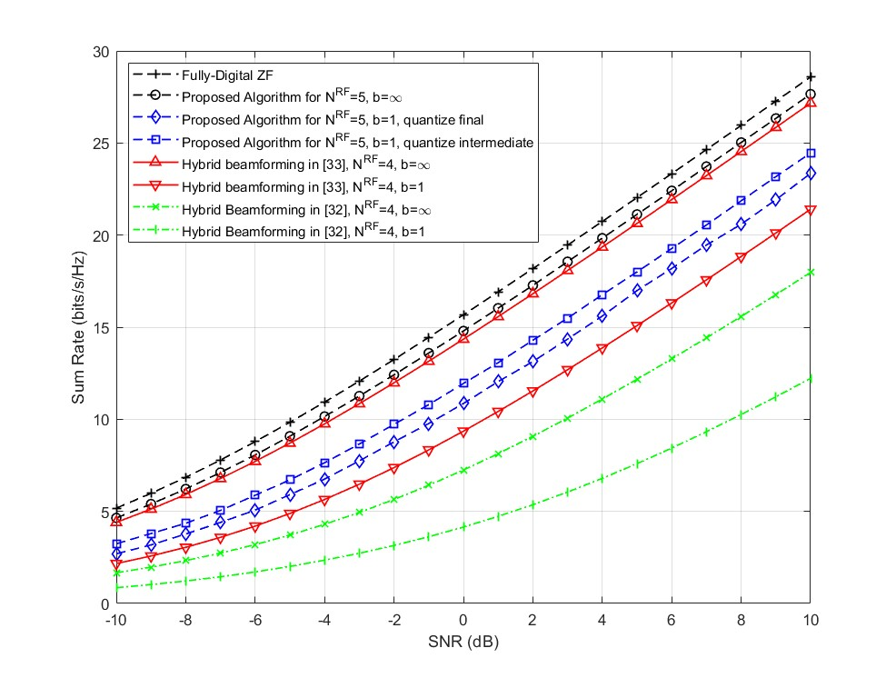

# SimLit-2016-JSTSP-Sohrabi

Reproduce results in the following paper using Matlab:

- Sohrabi, F. & Yu, W. (2016). Hybrid digital and analog beamforming design for large-scale antenna arrays. *IEEE Journal of Selected Topics in Signal processing, 10*(3), pp. 501-513. https://doi.org/10.1109/JSTSP.2016.2520912

## Brief Introduction of This Paper

This paper introduces a HBF precoding and combining scheme, where beamforming at TX and RX are decoupled, i.e., optimized separately. A precoder is usually referred to the beamformer at the transmitter, while combiner at the receiver.

**It should be highlighted that the scheme proposed in this paper requires at least $K+1$ RF chains, while most of the other related references assume the number of RF chains is equal to the number of users**.

### Single-User Case

In the precoder, the digital and analog beamformers are decoupled, where one is optimized assuming another is fixed. The digital beamformer is found by maximizing the capacity with power constraint, which is solved by *SVD* and *Water-Filling* algorithm. The analog beamformer is obtained by using an iterative coordinate descent algorithm to solve a reformulated capacity maximization problem with a relaxed unit norm constraint.  

In the combiner at the receiver, the hybrid beamformer is optimized separately as the precoder. With fixed digital beamformer, the analog beamformer can be optimized in the very similar scheme as the precoder. The digital beamformer is MMSE.

### Multi-User Case

In the precoder, ZF is used as digital beamformer to eliminate the inter-user interference. The analog precoder can be optimized by formulating a similar power minimization problem if digital precoder is fixed. Unlike the single-user case, an alternating optimization is done between digital and analog precoder. For simplicity, MISO system model is used in the multi-user case, where only one antenna is considered at the user side.

# Reproduced Results

## Introduction of the Matlab Scripts

Run "main_su.m" for figure 2 (single-user case), and "main_mu.m" for figure 5 (multi-user case). It is recommended to save the generated channels in your local storage by modifying the code. Afterwards, load the generated channels for simulation.

## Single-user Case

*Fig. 2. Spectral efficiencies achieved by different methods in a $64x16$ MIMO system where $N^{RF}=N_s=6$. For hybrid beamforming methods, the use of infinite resolution phase shifters is assumed.*

## Multi-user Case with Infinite-Resolution Phase Shifter

*Fig. 5. Sum rate achieved by different methods in an 8-user MISO system with N=64. For hybrid beamforming methods, the use of infinite resolution phase shifters is assumed.*

## Multi-user Case with Finite-Resolution Phase Shifter

*Fig. 6. Sum rate achieved by different methods in a 4-user MISO system with N=64. For the methods with finite resolution phase shifters, b=1.*