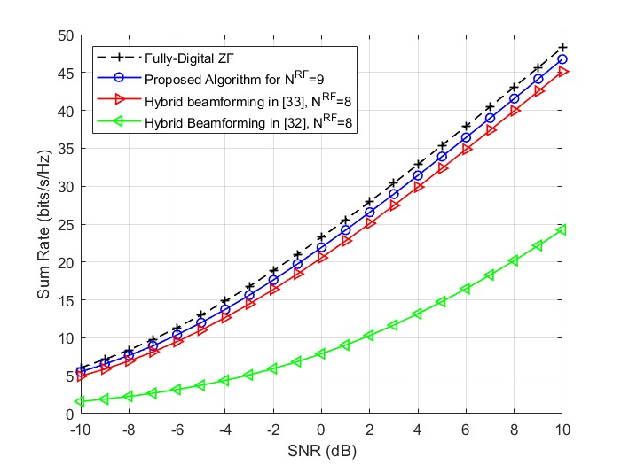

# SimLit-2016-JSTSP-Sohrabi

Reproduce the following paper in Matlab:

- Sohrabi, F. & Yu, W. (2016). Hybrid digital and analog beamforming design
  for large-scale antenna arrays. IEEE Journal of selected topics in signal
  processing, 10(3). https://doi.org/10.1109/JSTSP.2016.2520912

## Brief Conclusion of This Paper

# Reproduced Results

## Introduction of the Matlab Scripts

Run "main_su.m" for figure 2 (single-user case), and "main_mu.m" for figure 5 (multi-user case). It is recommended to save the generated channels in your local storage by modifying the code. Afterwards, load the generated channels for simulation.

## Single-user Case

*Fig. 2. Spectral efficiencies achieved by different methods in a $64x16$ MIMO system where $N^{RF}=N_s=6$. For hybrid beamforming methods, the use of infinite resolution phase shifters is assumed.*

## Multi-user Case

*Fig. 5. Sum rate achieved by different methods in an 8-user MISO system with N=64. For hybrid beamforming methods, the use of infinite resolution phase shifters is assumed.*

